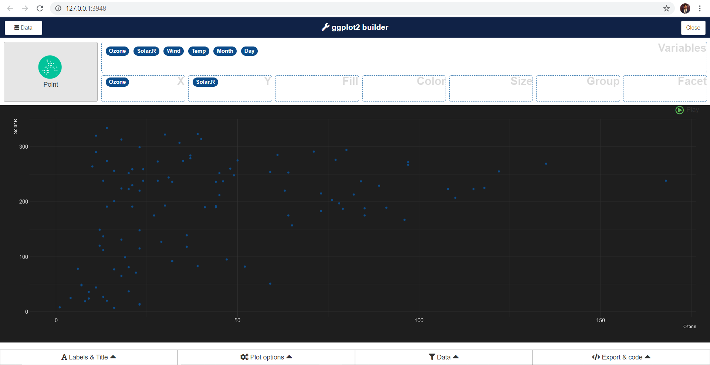

```{r, include = FALSE}
knitr::opts_chunk$set(
  collapse = TRUE,
  comment = "#>"
)
```

```{r setup, eval=FALSE}
library(shinyrecipes)
```

<style>
img {
  max-width: 700px;
  max-height: 400px;
}
</style>

## Analyzing your data

In this tab you can analyze your data in two ways:

- Reviewing the values of each variable in a table in which you can sort and / or filter.

- Launching [{esquisse}](https://dreamrs.github.io/esquisse/index.html) to analyze your data visually.


You can sort any variable as follows:


Finally, you can launch `esquisse` by pressing the "esquisse" button. Pressing the button sends an instruction to the command line that opens 'esquisse' in a web browser with the data passed in the ".df" argument loaded for analysis.Once you have finished using esquisse, it is good practice to press the button again to end the process on the open command line.


So in summary:

- Press the 'esquisse' button to open the app:


- Make your analysis:



- Press the button again:


