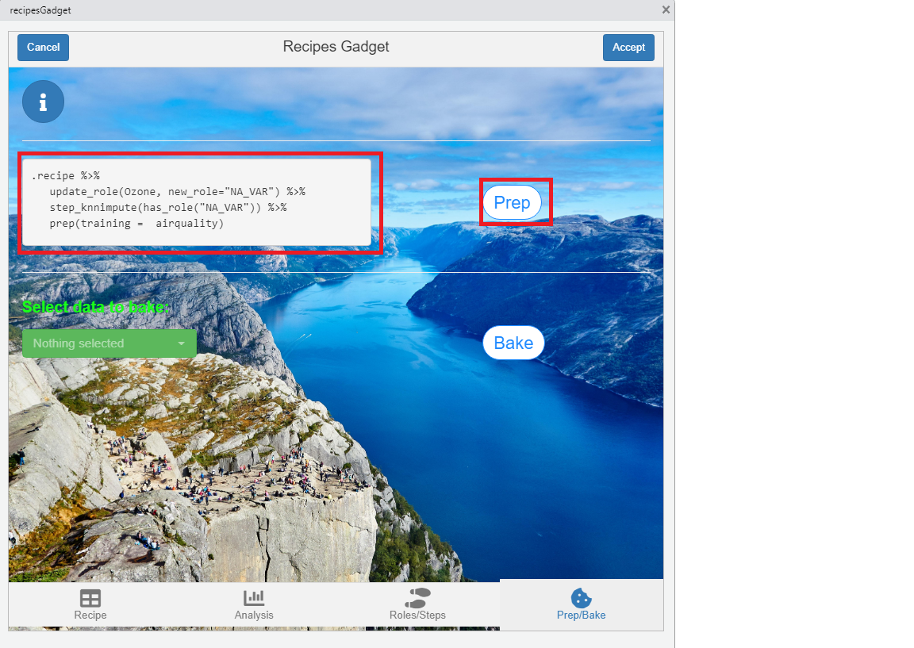
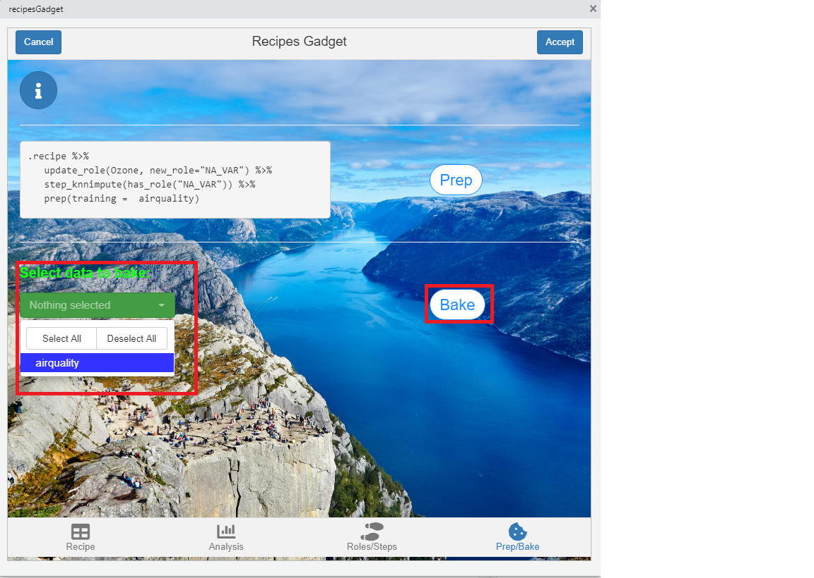
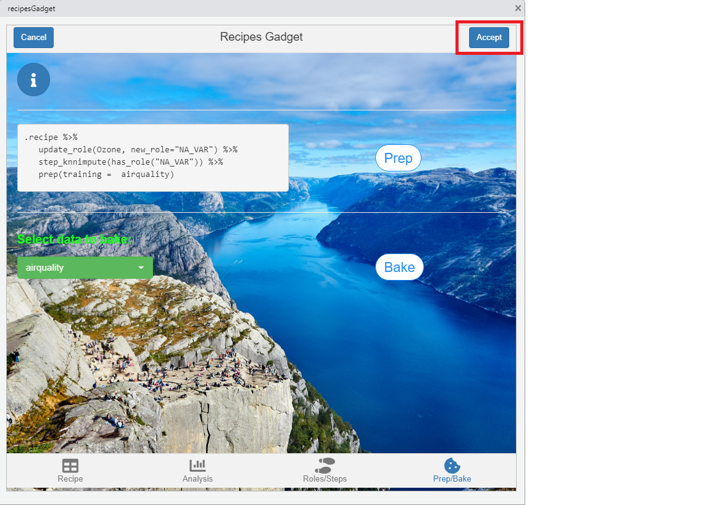

```{r, include = FALSE}
knitr::opts_chunk$set(
  collapse = TRUE,
  comment = "#>"
)
```

```{r setup, eval=FALSE}
library(shinyrecipes)
```

<style>
img {
  max-width: 700px;
  max-height: 400px;
}
</style>


## Prepare the recipe

You need to prepare the recipe created in the previous tabs. To do this, you can see the code that will be used and you only need to press the 'Prep' button.



## Using the recipe on new data

Once the recipe is prepared, you can apply this object to new data.To do this, select the data you want it to apply to (the data passed in the .df and bake_list arguments are the options) and press the 'Bake' button.




Finally, press the 'Accept' button to exit the gadget. The gadget will return a list containing two elements: the first will be the trained recipe and the second a list with all the data that has been applied to within the gadget.




