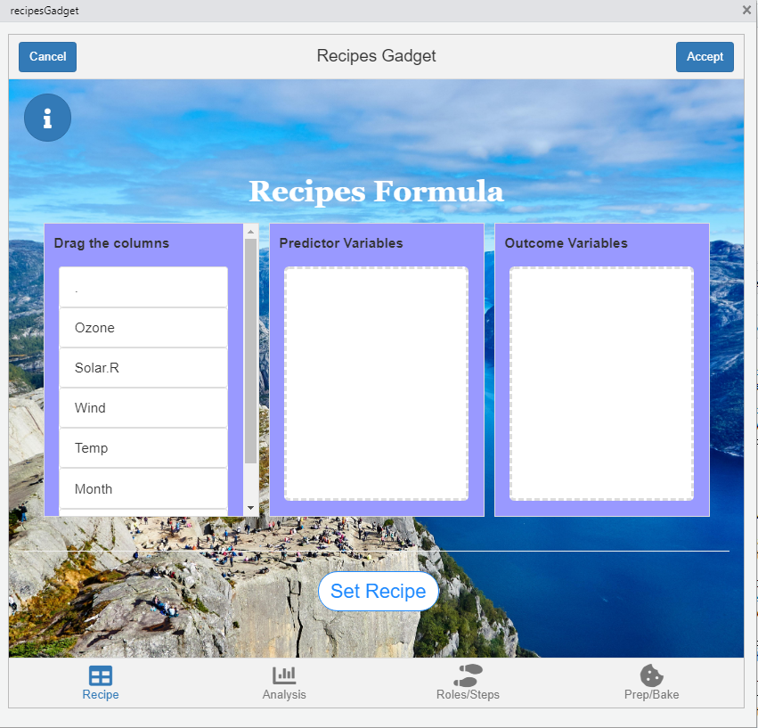
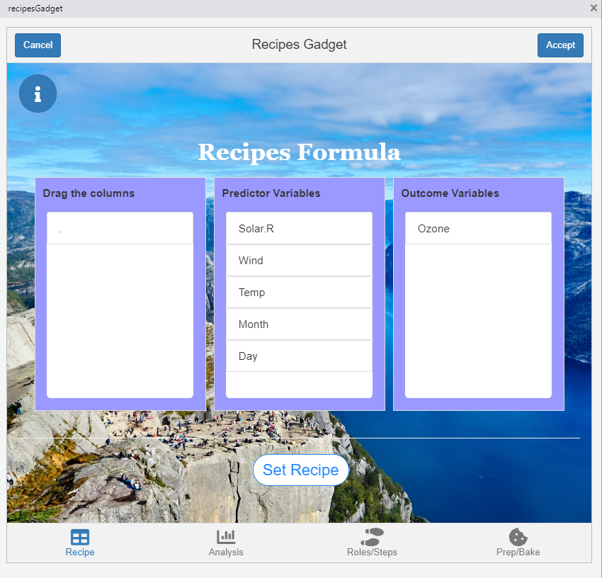
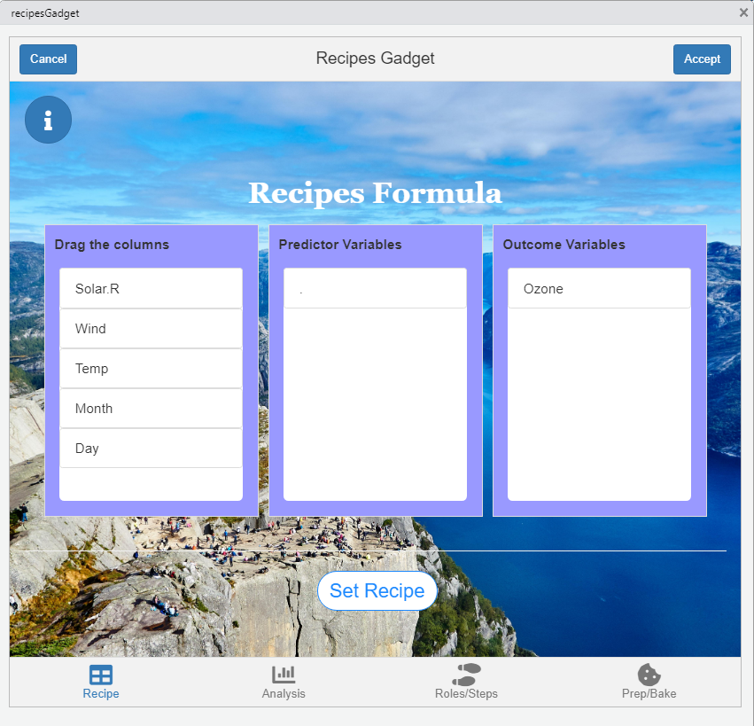

```{r, include = FALSE}
knitr::opts_chunk$set(
  collapse = TRUE,
  comment = "#>"
)
```

```{r setup, eval=FALSE}
library(shinyrecipes)
```

<style>
img {
  max-width: 700px;
  max-height: 400px;
}
</style>

## Prepare the recipes formula

The first step will be to create a recipe object from a formula. This causes the variables to be divided by roles: outcomes and predictors (these roles may be modified later). In the first tab we create this formula by dragging the variables to the predictor variables and outcomes variables.




We can create the next formula: Ozone ~ Solar.R + Wind + Temp + Month + Day as follows:





or equivalently:





Once your formula is ready, you need to press the "Set Recipe" button.


