```{r, include = FALSE}
knitr::opts_chunk$set(
  collapse = TRUE,
  comment = "#>"
)
```

```{r setup, eval=FALSE}
library(shinyrecipes)
```

<style>
img {
  max-width: 700px;
  max-height: 400px;
}
</style>

## Update Roles

As discussed in the section on creating the recipe, once it is created using a formula, variables are cataloged with roles of outcomes or predictors. Roles are useful to select/deselect the variables that we will use in the preprocessing steps. In this way, we can only choose to impute the missing values, for example, of the variables of a certain role. It may be useful to create new roles assigned to certain variables so that they can be selected later more easily. You can learn more about roles [{here}](https://cran.r-project.org/web/packages/recipes/vignettes/Roles.html#the-formula-method).


The process to modify roles in our gadget is simple:

1. First, you select the variables you want to modify (In this example, we select the 'Ozone' and 'Solar.R' variables that contain missing values and assign them the role 'NA_VAR'):

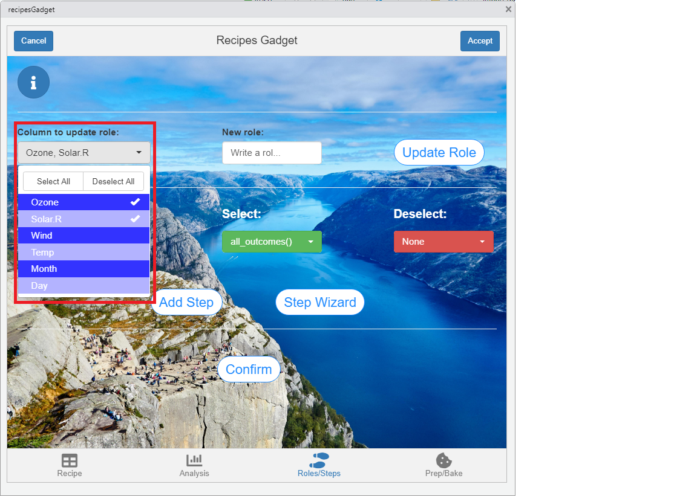

2. Write the name of the new role:


3. Press the 'Update Role' button:


You can repeat the process to update as many variable roles as you want.


## Add Steps

To add the steps you can choose two ways to do it. The first way is more limited, since you can only select the step, the variables you select and the ones you deselect (if necessary).The second way is through the 'Step Wizard', which allows you to use more advanced selection methods (such as tidyselect helpers) or modify the step parameters.

### First Method:

1. First, we select the step we want to apply.

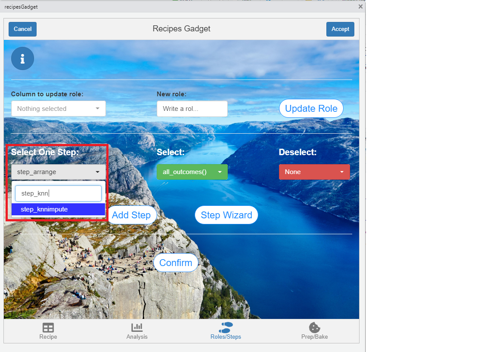


2. Select the variables on which it will be applied. The options are all_outcomes(), all_predictors(), all_nominal(), all_numerical(), the names of the variables and the roles created in the previous section. Find more information about selections using `?selections` in the console.

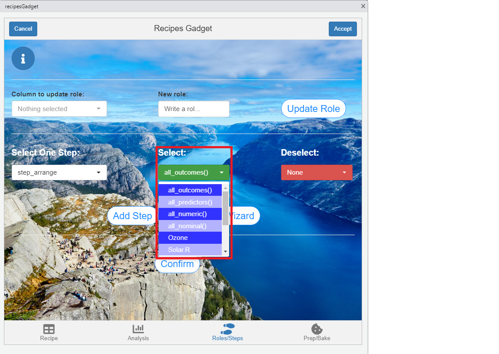

3. Deselect the variables you don't want the step to apply to. If you don't want to deselect any, leave the default value 'None'.

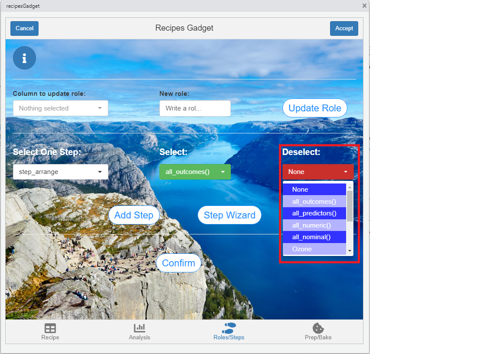

4. Finally, press the 'Add Step' button.


## Second Method: 'Step Wizard'

Many times, the first method is not enough because it does not offer all the possibilities to select variables or to modify the arguments of the steps. In this case, the solution is to use the wizard by pressing the 'Step Wizard' button.

1. Press the 'Step Wizard' button to launch it.


2. The wizard opens. You must press 'start' to start it.

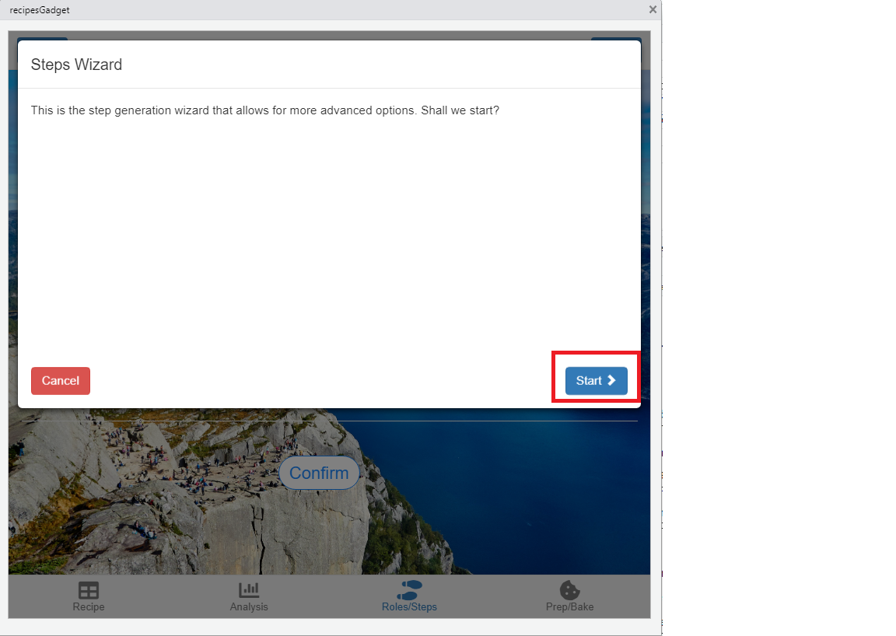


3. Select the step and press 'Next'.

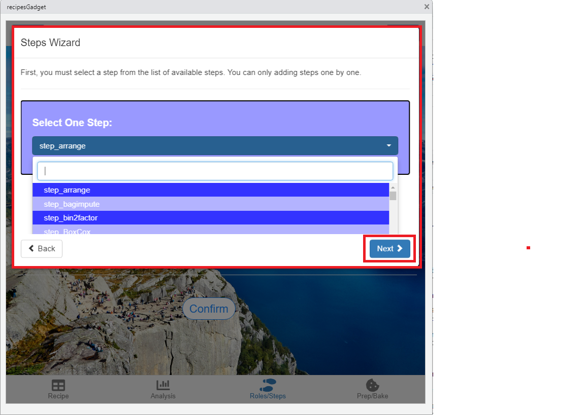


4.Select the variables on which the step will be applied. Now, you can use helpers like starts_with, contains, ends_with ... in addition to all the methods discussed above.

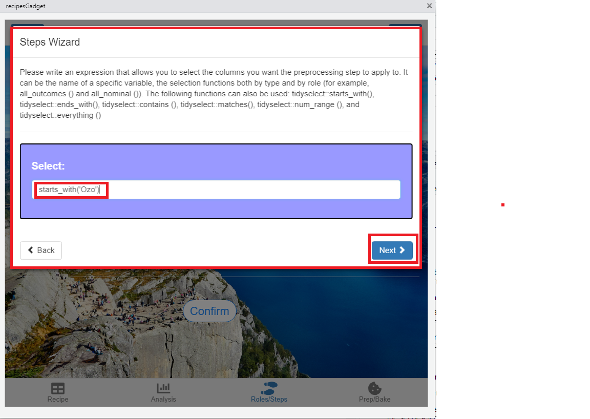


5.Deselect variables with the same methods applicable to the previous point. If you do not want to deselect any, leave 'None'.

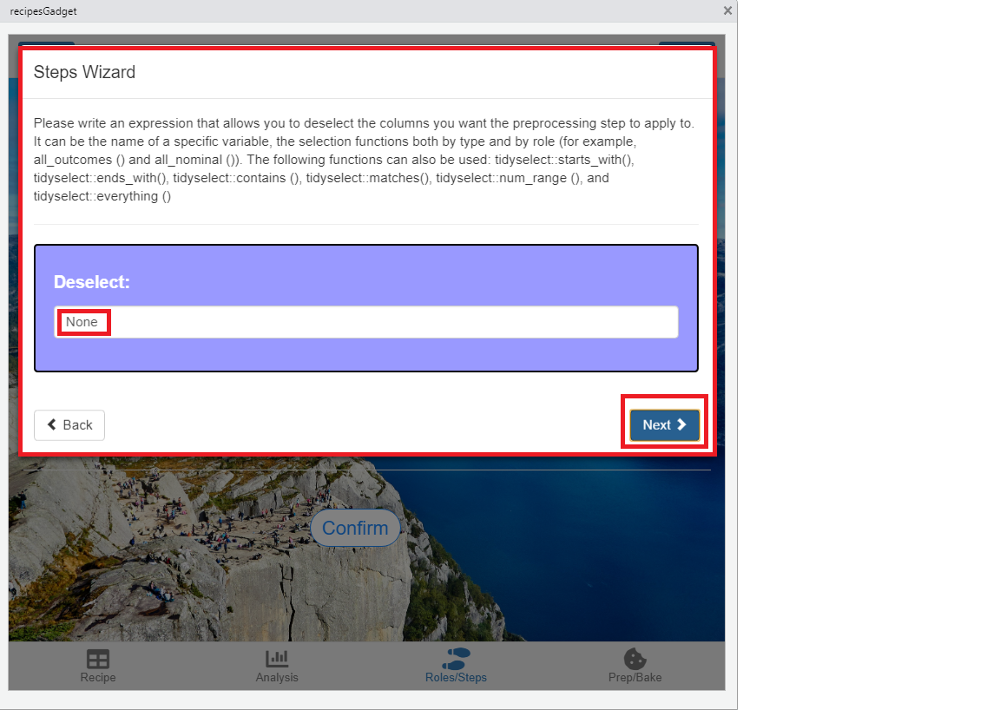


6.Modify the step parameters. For this, first select the parameter, then enter the new value and finally press the 'Change Parameter' button. Repeat this process with all the parameters you want to change.

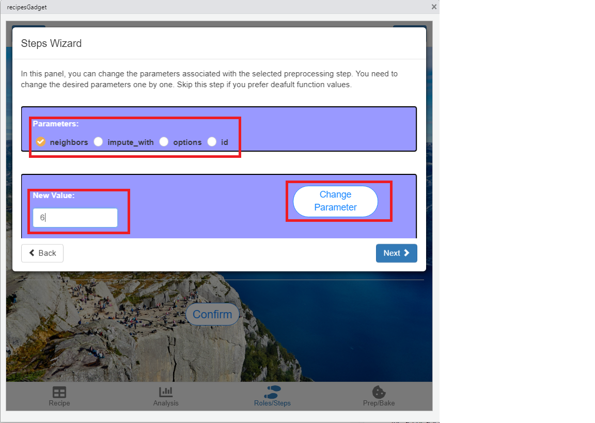


7. Press the 'Add Step' button to save the changes and click 'done' to leave the wizard.

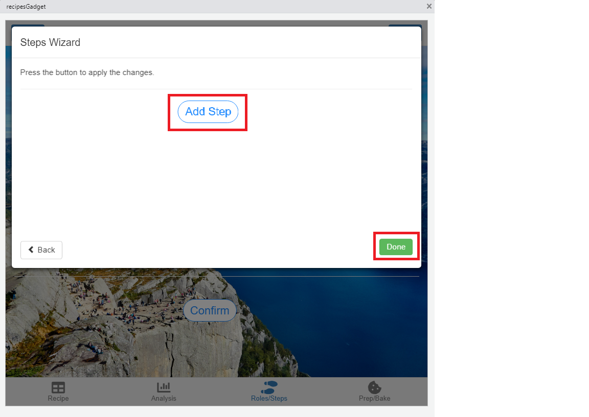

### Confirm Steps

Once you have added the steps (either by the first method, the wizard or both), it is necessary to confirm those steps that will finally be applied.To do this, press the 'Confirm' button to initialize another wizard.

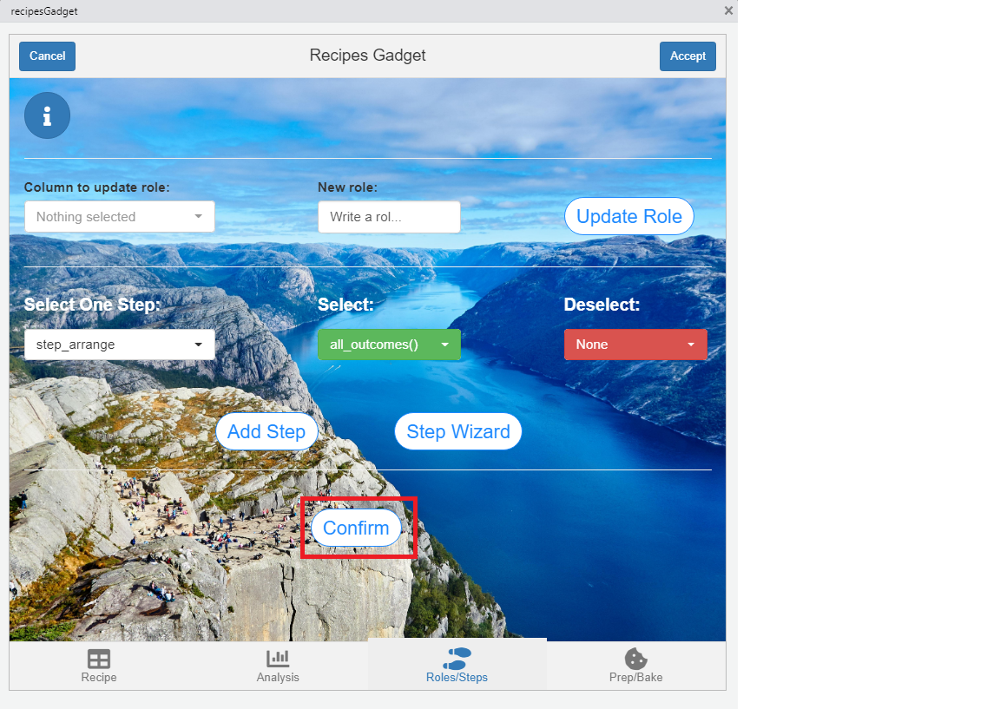

You must select all the steps you want to apply and press the 'Confirm' button. Once done, press 'done' to exit the wizard.

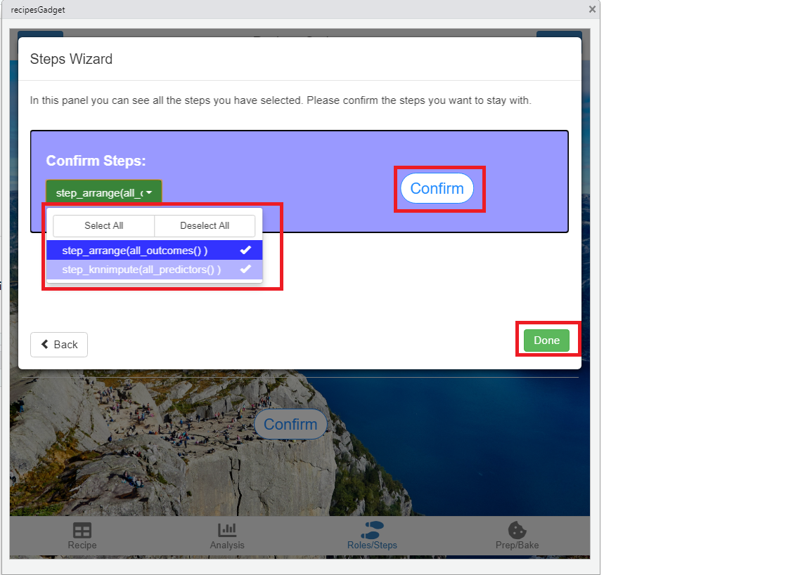
